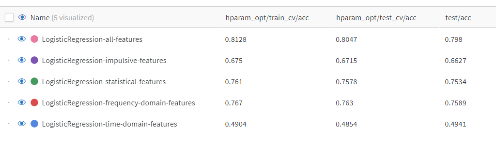

## Experiment propositions:

Initially, the problem is going to be defined as a multi-class classification and the following experiments are going to be made:

1.1. Train a simple baseline linear model (LogisticRegression) on only a subset of features (time-domain statistical features);
1.2. Retrain the same baseline model on other subsets of features (time-domain impulsive, spectral, and envelope features);
1.3. Train the baseline model with all features;

Results: comparison table from experiments 1, 2, and 3.

2. Explore different more capable models (RF, SVM, XGBoost, CatBoost, etc.);

Results: comparison table with all the different model results.

3. After those experiments, repeat for the multi-label approach.
